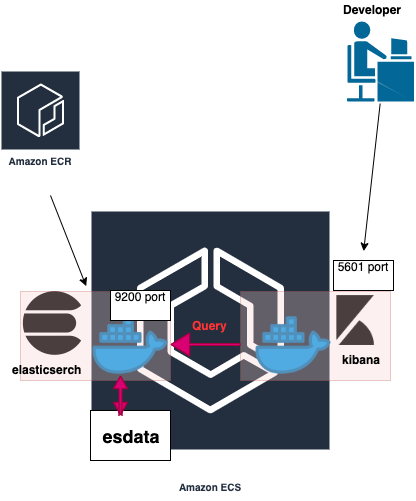

# terraform-elasticsearch-and-kibana-on-ecs
## Overview of infrastructure


## How to use
### 1. Clone this project
### 2. Set your AWS credential
### 3. Change variables.tf
```hcl:variables.tf
variable "vpc_id" {
 default = "YOUR_VPC_ID"
}
variable "subnet_id" {
  default = "YOUR_SUBNET_ID"
}
```
### 4. Deploy ecr resource
```sh
- terraform init
- terraform apply --target=module.hoge_test_es_app_ecr
```
### 5. Build elasticsearch image and push it into ecr repository.

```sh
- cd ./elasticsearch
- docker build -t es-test:latest .
- docker tag es-test:latest ${YOUR_AWS_ACCOUNT_ID}.dkr.ecr.${YOUR_REGION}.amazonaws.com/es-test:latest
- (aws ecr get-login --region ap-northeast-1)
- docker push ${YOUR_AWS_ACCOUNT_ID}.dkr.ecr.${YOUR_REGION}.amazonaws.com/es-test:latest
```
### 6. Change es_task_container_definitions.json to refer to ecr's image
```json:es_task_container_definitions.json
[
  {
    "name": "ec-test",
    "image": "${YOUR_AWS_ACCOUNT_ID}.dkr.ecr.${YOUR_REGION}.amazonaws.com/es-test:latest",
    "cpu": 0,
    "memory": 60000,
    "memoryReservation": 60000,
    "portMappings": [
      {
        "containerPort": 9200,
        "hostPort": 9200,
        "protocol": "tcp"
      },
      {
        "containerPort": 9300,
        "hostPort": 9300,
        "protocol": "tcp"
      }
    ],
    "essential": true,
    "environment": [
      {
        "name": "ES_JAVA_OPTS ",
        "value": "-Xms8g -Xmx8g "
      },
      {
        "name": "REGION",
        "value": "ap-northeast-1"
      }
    ],
    "mountPoints": [
      {
        "sourceVolume": "esdata",
        "containerPath": "/usr/share/elasticsearch/data/"
      }
    ],
    "volumesFrom": [],
    "disableNetworking": false,
    "readonlyRootFilesystem": false,
    "ulimits": [
      {
        "name": "nofile",
        "softLimit": 65536,
        "hardLimit": 65536
      }
    ],
    "logConfiguration": {
      "logDriver": "awslogs",
      "options": {
        "awslogs-group": "/ecs/es-test",
        "awslogs-region": "ap-northeast-1",
        "awslogs-stream-prefix": "ecs"
      }
    }
  }
]
```
### 7. Deploy other resources
```sh
- terraform deploy
```
### 8. Access http://${CONTAINER_INSTANCE_PUBLIC_IP}:5601 
Kibana dev-tool makes it possible for us to execute query DSL without curl command.

